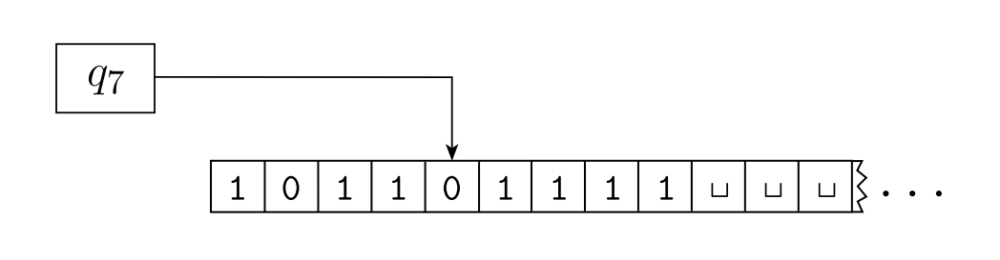

## Turing Machines

**Definition**: A **Turing machine** is a 7-tuple, $\left(Q, \Sigma, \Gamma, \delta, q_{0}, q_{\text {accept }}, q_{\text {reject }}\right)$, where $Q$, $\Sigma$, $\Gamma$ are all finite sets and 
1. $Q$ is the set of states
2. $\Sigma$ is the input alphabet not containing the **blank symbol** $\_$
3. $\Gamma$ is the tape alphabet, where $\_ \in \Gamma$ and $\Sigma \subseteq \Gamma$,
4. $\delta: Q \times \Gamma \longrightarrow Q \times \Gamma \times\{\mathrm{L}, \mathrm{R}\}$ is the transition function,
5. $q_{0} \in Q$ is the start state,
6. $q_{\text {accept }} \in Q$ is the accept state, and
7. $q_{\text {reject }} \in Q$ is the reject state, where $q_{\text {reject }} \neq q_{\text {accept }}$.

As a Turing machine computes, changes occur in the current state, the current tape contents, and the current head location. A setting of these three items is called a **configuration** of the Turing machine. \
We write $u q v$ for the configuration where the current state is $q$, the current tape contents is $uv$, and the current head location is the first symbol of $v$

