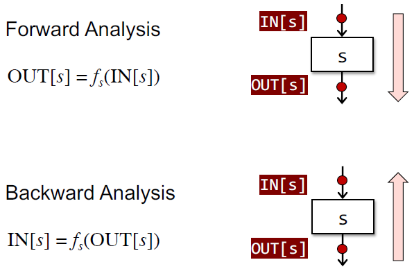

## Control Flow Graphs (CFG)

### Construction

#### Nodes (Basic Blocks

INPUT: a sequencce of three-address instructions of `P`
OUTPUT: a list of basic blocks of `P`
METHOD:
1. determine the leads in `P`
    - the first instruction in `P` is a leader 
    - any target instruction of a conditional or unconditional jump is a leader
    - any instruction that immediately follows a conditional or unconditional jump is a leader
2. build BBs for `P`
    - a BB consists of a leader and all its subsequent instructions until the next leader

#### Edges

- There is a conditional or unconditional jump from the end of A to the beginning of B
- B immediately follows A in the original order of instructions and A does not end in an unconditional jump

## Data Flow Analysis

设数据流分析的值域是 $V$，可定义一个 k-tuple： $(OUT[n_1], OUT[n_2], \ldots , OUT[n_k])$。是集合 $V^k = (V_1, V_2, \ldots, V_k)$ 的一个元素，表示每次迭代后 $k$ 个节点整体的值。

每一次迭代可看作是 $V^k$ 映射到新的 $V^k$，通过转换规则和控制流来映射，记作函数 $F：V^k \rightarrow V^k$

通过不断迭代，直到相邻两次迭代的 k-tuple 值一样，算法结束。

$$
\begin{aligned}
(\perp, \perp, \ldots, \perp) &= X_{0} \\
\left(v_{1}^{1}, v_{2}^{1}, \ldots, v_{k}^{1}\right) &= X_{1}=F\left(X_{0}\right) \\
\left(v_{1}^{2}, v_{2}^{2}, \ldots, v_{k}^{2}\right) &= X_{2}=F\left(X_{1}\right) \\

\cdots \\

\left(v_{1}^{i}, v_{2}^{i}, \ldots, v_{k}^{i}\right) &= X_{i} = F\left(X_{i - 1}\right) \\
\left(v_{1}^{i + 1}, v_{2}^{i + 1}, \ldots, v_{k}^{i + 1}\right) &= X_{i + 1} = F\left(X_{i}\right) \\
\end{aligned}
$$

数据流分析可以看做是迭代算法对格点 利用转换规则和 meet/join 操作。

## Data Flow Analysis - Applications

Each node is associated with a **Transfer Function** according to the semantics of statements.\
Each program point is associated with a data-flow value that represents an abstraction of the set of all possible program states that can be observed 
  
- Forward Analysis: `OUT[stm] = f(IN[stm])`
- Backward Analysis: `IN[stm] = f(OUT[stm])`

**Data Flow analysis** is to find a solution to a set of safe-approximation directed **constraints** on the `IN[stm]`'s and `OUT[stm]`'s, for all statements `stm`

### Control Flow's Constraints

- Control flow within a Basic Block: $\operatorname{IN}\left[s_{i+1}\right]=\operatorname{OUT}\left[s_{i}\right],$ for all $i=1,2, \ldots, \mathrm{n}-1$
- Control flow among Basic Blocks:
    - $\mathrm{IN}[B]=\mathrm{IN}\left[s_{1}\right]$ & $\mathrm{OUT}[B]=\mathrm{OUT}\left[s_{n}\right]$
    - for Forward Analysis:
        - $\operatorname{OUT}[B]=f_{B}(\operatorname{IN}[B]), f_{B}=f_{S_{n}} \circ \ldots \circ f_{S_{2}} \circ f_{S_{1}}$
        - $\mathrm{IN}[B]=\bigwedge P$ a predecessor of $B \mathrm{OUT}[P]$
    - for Backward Analysis
        - $\operatorname{IN}[B]=f_{B}(\mathrm{OUT}[B]), f_{B}=f_{S_{1}} \circ \ldots \circ f_{S_{S-1}} \circ f_{S_{n}}$
        - $\operatorname{OUT}[B]=\Lambda_{S \text { a successor of B}} \mathrm{IN}[S]$

大多数情况下，optimization application 都需要一个 conservative approximations. 如果我们拿到了错误的信息，那么我们的优化就可能是 unsound，并且会影响到程序本来的语义。

一个 canonical choice 是为每个名为 $id$ 的变量 introduce a target $\&id$ 
为每个 allocation site introduce a target $malloc_i$ 其中 i 是一个唯一的 index

points to analysis 发生在 syntax tree 上，因为发生在 control flow analysis 之前或同时进行。
points to analysis 的结果是一个函数 $pt(pointer)$ 返回 set of possible pointer targets。 如果我们想知道两个指针 $p$ & $q$ 是否可能是  aliases，那么一个安全的做法就是比较其交集 $p t(p) \cap p t(q)$

#### Andersen’s Algorithm

对每个 variable named $id$，用集合 $\llbracket id \rrbracket$ 表示所有可能的 pointer targets

分析假设程序已经倍 normalized，也就是说 pointer manipulation 仅限于以下几种
1 $id = malloc$，生成 constraints: $\{\mathrm{malloc_i}\} \subseteq \llbracket id \rrbracket$
2 $id_1 = \&id_2$，生成 constraints: $\left\{\& i d_{2}\right\} \subseteq \llbracket i d_{1} \rrbracket$
3 $id_1 = id_2$，生成 constraints: $\llbracket i d_{2} \rrbracket \subseteq \llbracket i d_{1} \rrbracket$
4 $id_1 = *id_2$，生成 constraints: $\& i d \in \llbracket i d_{2} \rrbracket \Rightarrow \llbracket i d \rrbracket \subseteq \llbracket i d_{1} \rrbracket$
5 $*id_1 = id_2$，生成 constraints: $\& i d \in \llbracket i d_{1} \rrbracket \Rightarrow \llbracket i d_{2} \rrbracket \subseteq \llbracket i d \rrbracket$
6 $id = null$，生成 constraints: $\emptyset \subseteq \llbracket i d \rrbracket$ which 可以安全的被忽略

最后我们得到 5 种 constraints，最后解这些约束就得到算法的结果

#### Steensgaard’s Algorithm

另一个更粗略度一点的算法，by viewing assignments as being bidirectional.

TODO

解这些约束就得到算法的结果，The resulting points-to function is defined as:
$$ pt(p)=\{\& id \mid * p \sim id \} \cup \{ malloc_i \mid * p \sim malloc_i \}$$

#### Interprocedural Points-To Analysis

函数指针也可能有 indirect references，我们需要同时做 control flow analysis and the points-to analysis。例如：`(***x)(1,2,3);`

我们可以对程序做一个简化，使得 function calls 总是形如 `id1 = (id2)(a1, ..., an);`。类似的 all return expressions are assumed to be just variables.

到目前为止我们都只是把 heap 看作一个 amorphous 结构，几乎只关注了 stack based vars. 我们可以用 shape analysis 对堆进行更细致的分析。

Shape graphs 是一个有向图，其每一个节点都是一个 pointer targets。Shape graphs 的 order 根据 inclusion of their sets of edges 定义。Thus, $\perp$ is the graph without edges and $\top$ is the completely connected graph.\
pointer targets 表示在执行期间可能创建的 memory cells，边表示两个 cell 间可能包含一个引用。
