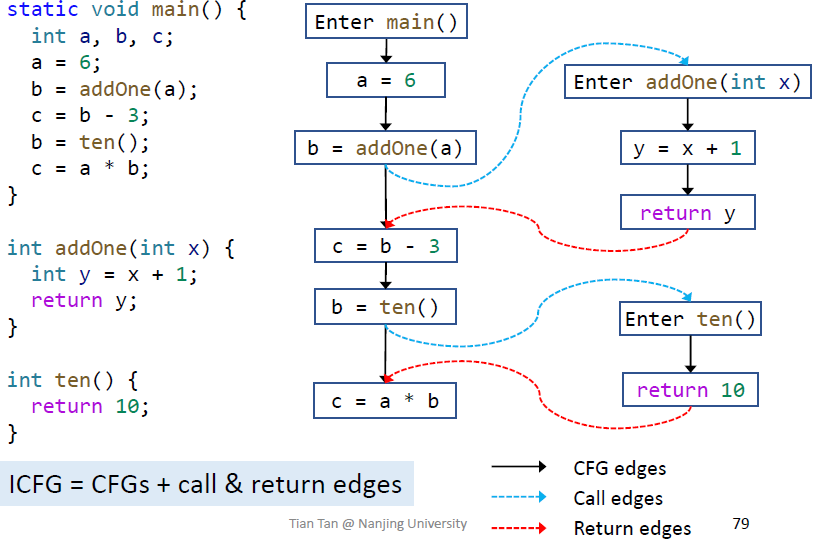

**Definition**: Call Graph 


### Class Hirarchy Analysis (CHA) 

|                                          | Static Call  | Special Call                        | Virtual Call                  |
|------------------------------------------|--------------|-------------------------------------|-------------------------------|
| 指令                                     | invokestatic | invokespecial                       | invokeinterface/invokevirtual |
| Receiver objects                         | ×            | ✓                                   | ✓                             |
| 目标函数                                 | Static 函数  | 构造函数、 私有函数、父类的实例函数 | 其他实例函数                  |
| 目标函数个数                             | 1            | 1                                   | ≥1 (polymorphism              |
| 何时确定                                 | 编译时       | 编译时                              | 运行时                        |


根据每个 virtual call 的 receiver variable 的声明类型来求解所有可能调用的目标函数。


```
call_site_sig = dec_class_ty + func_name + descriptor
    where descriptor = ret_ty + param_ty

dispatch rx m = 
    if (rx contains non-abstract method m' that has the same name and descriptor as m)
    then m'
    else dispatch (parent_class rx) method

resolve cs = 
    let sig = method signature at cs 
    if cs is a static call then 
        return { sig }
    else if cs is special call then 
        let c = dec_class_ty of sig
        return { dispatch c m }
    else // cs is a virtual call
        let ret = {}
        let c = dec_class_ty of sig
        foreach c' is a subclass of c or c itself do 
            push ret (dispatch c' m)
        return ret
```

e.g. given following class hierarchy

```java
class A {
    void foo() {}
}
class B extends A {}
class C extends B {
    void foo() {}
}
class D extends B {
    void foo() {}
}

void func() {
    C c = ...;
    c.foo(); // dispatch => { C.foo() `}

    A a = ...;
    a.foo(); // dispatch => { A.foo(), C.foo(), D.foo() }

    B b = ...;
    b.foo() // dispatch => { A.foo(), C.foo(), D.foo() }
}
```

### 利用 CHA 构造调用图

遍历每个函数中的每个调用指令，调用 CHA 的 Resolve () 找到对应的目标函数和调用边，函数 + 调用边 = 调用图。

```
build entry = 
    let work_list = {}, call_graph = {}, visited = {}
    while let Some(curr) = work_list.pop() && cur is not visited 
        mark curr as visited 
        foreach call site cs in curr do
            let possible_methods = resolve cs
            foreach method in possible_methods do 
                add (cs -> method) to call_graph
                add method to work_list

    return call_graph
```


## 过程间控制流分析

**Definition**: ICFG = CFGs + (Call edges + Return edges)



|          | intraprocedural | interprocedural                   |
|----------|-----------------|-----------------------------------|
| 程序表示 | CFG             | ICFG = CFGs + call & return edges |
| 转换规则 | Node transfer   | Node transfer + edge transfer     |

Node transfer: same as intra procedural constant propagation, plus that
- For each call node, kill data flow value for the LHS variable. Its value will flow to return site along the return edges
Edge transfer: 
- Call edge transfer : transfer data flow from call node to the entry node of callee (along call edges) （传参数）
- Return edge transfer : transfer data flow from return node of the callee to the return site (along return edges) （传返回值）

e.g., Interprocedural Constant Propagation

